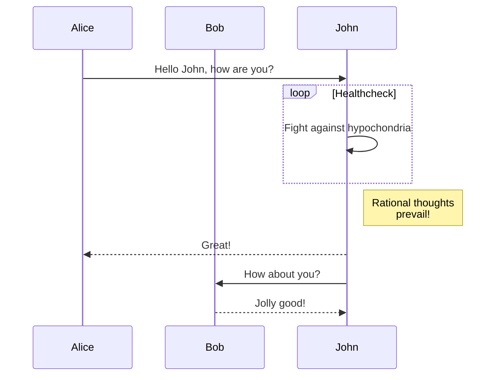

GitBook is an amazing frontend style to present and organize contents (such as book chapters
and blogs) on Web. The typical to deploy GitBook at [Github Pages][1]
is building HTML files locally and then push to Github repository, usually to the `gh-pages`
branch. However, it's quite annoying to repeat such workload and make it hard for people do
version control via git for when there are generated HTML files to be staged in and out.

This theme takes style definition out of generated GitBook site and provided the template
for Jekyll to rendering markdown documents to HTML, thus the whole site can be deployed
to [Github Pages][1] without generating and uploading HTML bundle every time when there are
changes to the original repository.

[1]: https://pages.github.com


```diff
  ---
  title: Page with cover image
  author: Tao He
  date: 2022-05-24
  category: Jekyll
  layout: post
+ cover: /assets/jekyll-gitbook/dinosaur.gif
  ---
```

This jekyll-theme supports [mermaid.js](https://mermaid.js.org/) to render diagrams
in markdown.

To enable the mermaid support, you need to set `mermaid: true` in the front matter
of your post.

```markdown
---
title: Diagrams with mermaid.js
date: 2023-08-31
layout: post
mermaid: true
---
```

Then you can use mermaid syntax in your markdown:

```
graph TD;
    A-->B;
    A-->C;
    B-->D;
    C-->D;
```


Or, even some complex examples:

```
sequenceDiagram
    participant Alice
    participant Bob
    Alice->>John: Hello John, how are you?
    loop Healthcheck
        John->>John: Fight against hypochondria
    end
    Note right of John: Rational thoughts <br/>prevail!
    John-->>Alice: Great!
    John->>Bob: How about you?
    Bob-->>John: Jolly good!
```



Refer to the [mermaid.js website](https://mermaid.js.org/intro/) for more examples.


This jekyll-theme supports [MathJax](https://www.mathjax.org/) to render $\LaTeX$
and mathematics expressions.

> ##### TIP
>
> Currently, Kramdown uses double dollar sign delimiters for inline and display math:
> [https://kramdown.gettalong.org/syntax.html#math-blocks](https://kramdown.gettalong.org/syntax.html#math-blocks).
{: .block-tip }

e.g.,

```markdown
The well known Pythagorean theorem $x^2 + y^2 = z^2$ was
proved to be invalid for other exponents.
Meaning the next equation has no integer solutions:

$$ x^n + y^n = z^n $$
```

The well known Pythagorean theorem $x^2 + y^2 = z^2$ was
proved to be invalid for other exponents.
Meaning the next equation has no integer solutions:

$$ x^n + y^n = z^n $$

Another example with more complex markups:

```markdown
When $a \ne 0$, there are two solutions to $ax^2 + bx + c = 0$ and they are

$$x = {-b \pm \sqrt{b^2-4ac} \over 2a}.$$
```

When $a \ne 0$, there are two solutions to $ax^2 + bx + c = 0$ and they are

$$x = {-b \pm \sqrt{b^2-4ac} \over 2a}.$$

Refer to the [MathJax website](https://docs.mathjax.org/en/latest/index.html) for more examples.


The jekyll-gitbook theme leverages [jekyll-toc][1] to generate the *Contents* for the page.
The TOC feature is not enabled by default. To use the TOC feature, modify the TOC
configuration in `_config.yml`:

```yaml
toc:
    enabled: true
```

Why this repo
-------------

long contents .....

1. a
2. b
3. c
4. d

### Sub title 1

### Sub title 2

### Sub title 3

Why this repo
-------------

long contents .....

+ 1
+ 2
+ 3
+ 4

Why this repo
-------------

long contents .....

1. e
2. f
3. g
4. h

Why this repo
-------------

+ 5
+ 6
+ 7
+ 8

Why this repo
-------------

long contents .....

1. a
2. b
3. c
4. d

Why this repo
-------------

long contents .....

+ 1
+ 2
+ 3
+ 4

Why this repo
-------------

long contents .....

1. e
2. f
3. g
4. h

Why this repo
-------------

+ 5
+ 6
+ 7
+ 8

Why this repo
-------------

long contents .....

1. a
2. b
3. c
4. d

Why this repo
-------------

long contents .....

+ 1
+ 2
+ 3
+ 4

Why this repo
-------------

long contents .....

1. e
2. f
3. g
4. h

Why this repo
-------------

+ 5
+ 6
+ 7
+ 8

Why this repo
-------------

long contents .....

1. a
2. b
3. c
4. d

Why this repo
-------------

long contents .....

+ 1
+ 2
+ 3
+ 4

Why this repo
-------------

long contents .....

1. e
2. f
3. g
4. h

Why this repo
-------------

+ 5
+ 6
+ 7
+ 8

[1]: https://github.com/allejo/jekyll-toc
